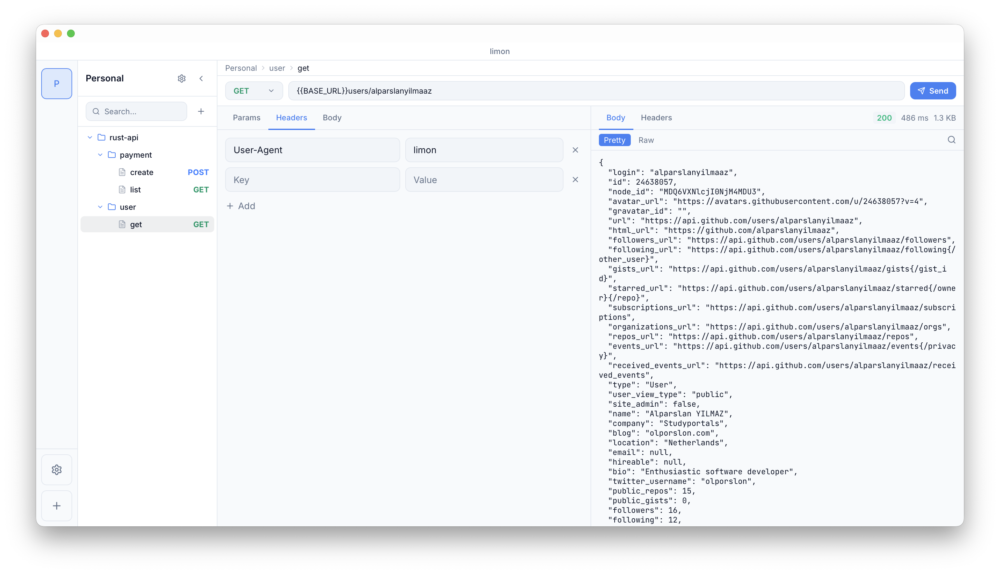
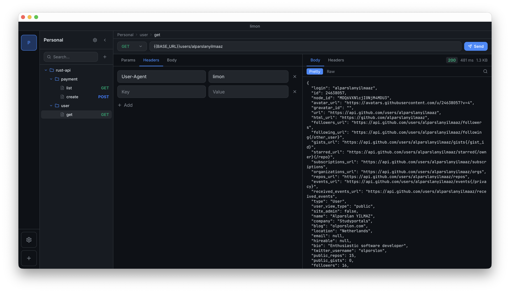
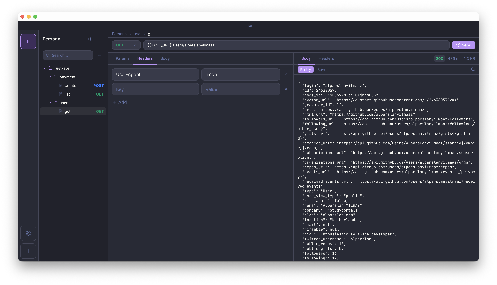
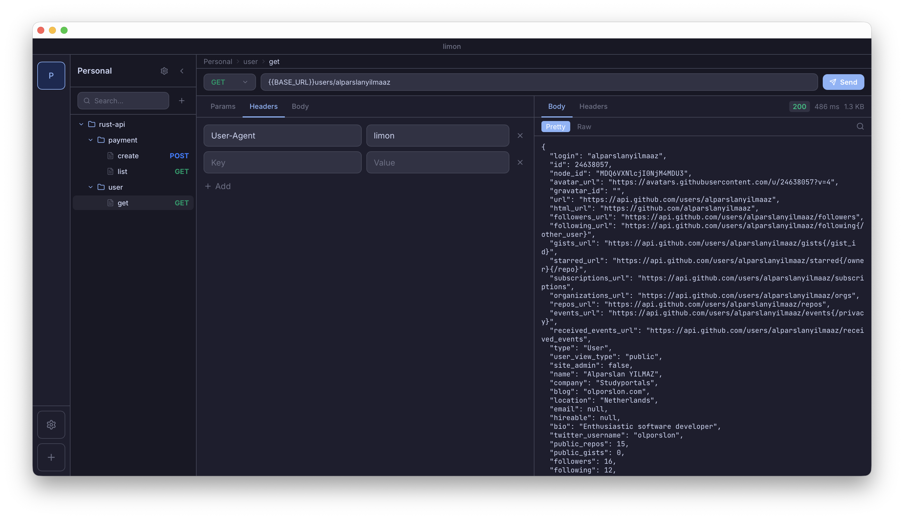
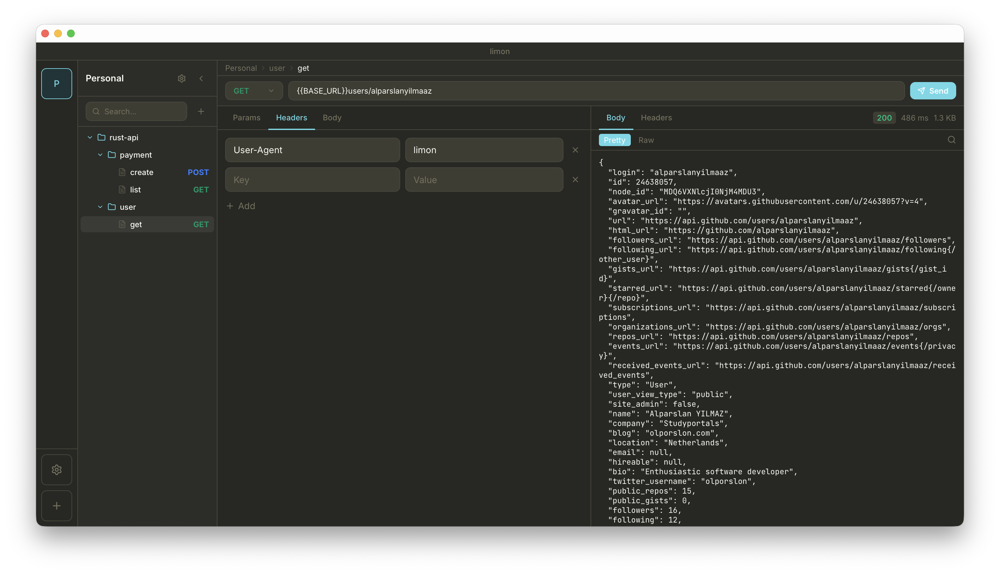
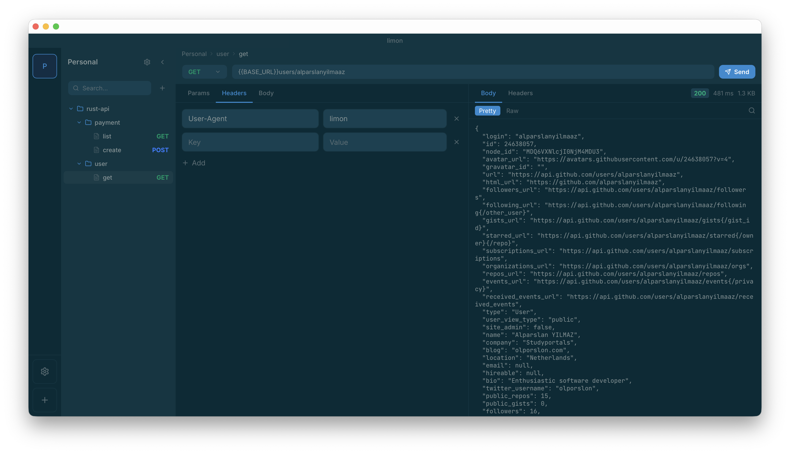

# limon

A lightweight desktop HTTP client for testing and debugging APIs. Think Postman or Insomnia, but faster to open and simpler to use.

Built with Tauri, React, and Rust. Your requests and data live entirely on your machine, stored in a local SQLite database.

<br/>

<table>
  <tr>
    <td align="center">
      
      <br/><sub><b>Light</b></sub>
    </td>
    <td align="center">
      
      <br/><sub><b>Dark</b></sub>
    </td>
  </tr>
  <tr>
    <td align="center">
      
      <br/><sub><b>Dracula</b></sub>
    </td>
    <td align="center">
      
      <br/><sub><b>Catppuccin</b></sub>
    </td>
  </tr>
  <tr>
    <td align="center">
      
      <br/><sub><b>Monokai</b></sub>
    </td>
    <td align="center">
      
      <br/><sub><b>Solarized</b></sub>
    </td>
  </tr>
</table>

<br/>

## What you can do with it

You can organize your requests into organizations and folders, build requests with custom headers, query params, and JSON or raw bodies, and see the full response with status codes, headers, elapsed time, and response size. There is also environment variable support per organization so you can swap base URLs or tokens without editing every request.

On top of that you get things like configurable SSL verification, proxy support, redirect control, timeout settings, and a response size limit to handle large payloads gracefully.

Six built-in themes (Light, Dark, Monokai, Catppuccin Mocha, Dracula, Solarized) and a compact mode are available if you care about that kind of thing.

## Download

Head over to the [Releases](https://github.com/alparslanyilmaaz/limon/releases) page and grab the installer for your platform.

| Platform | File |
| -------- | ---- |
| macOS (Apple Silicon + Intel) | `.dmg` |
| Windows | `.msi` or `.exe` |
| Linux | `.AppImage` or `.deb` |

Just download, install, and open. No account, no cloud sync, no telemetry.

## Running it locally

You'll need Node.js (v20+) and Rust installed on your machine. If you don't have Rust yet, the quickest way is:

```bash
curl --proto '=https' --tlsv1.2 -sSf https://sh.rustup.rs | sh
```

Then clone the repo and start the dev build:

```bash
git clone https://github.com/alparslanyilmaaz/limon.git
cd limon
npm install
npm run tauri dev
```

That starts the Vite dev server and the Tauri app together with hot reload.

To build a production binary for your current platform:

```bash
npm run tauri build
```

The output will be in `src-tauri/target/release/bundle/`.

## Tech stack

The frontend is React with TypeScript, Tailwind CSS for styling, and Zustand for state management. The backend is a Tauri app written in Rust that handles the actual HTTP requests using `reqwest` and stores everything in SQLite via `rusqlite`. No external services involved at any point.

## Contributing

Feel free to open an issue if you find a bug or have a feature idea. Pull requests are welcome too.

## License

MIT
